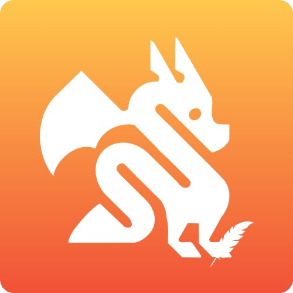

# Ye Olde Dragon


## Introduction
Ye Olde Dragon is a statically-typed, object-oriented scripting language whose name was inspired by its parent languages, Python🐉, Javascript 📜, and Swift (like a dragon 🏃‍♂️💨). We intend to bring together the best of all three worlds to create a highly effective and readable language that combines our favorite features and strengths from each. Ye Olde Dragon’s easily understandable syntax makes it an accessible language for beginners and experienced programmers alike, due to its powerful and versatile functionalities.

Ye Olde Dragon is brought to you by [Raihana Zahra](https://github.com/raihanaza), [Lauren Campbell](https://github.com/laurenindira), [Cecilia Zaragoza](https://github.com/ceciliazaragoza), and [Z Anderson](https://github.com/alexanderson22).

Our langauge website can be found at https://raihanaza.github.io/YeOldeDragon/.

## Features
- .yod File Extension
- Static and strong typing
- Manifest typing
- Ternary Conditional Statement
- Truthy/Falsy types
- Switch statements without fall-through


## Types
| YeOldeDragon          | JavaScript           |
|--------------|-----------------|
| string       | String          |
| int          | Number          |
| float        | Number          |
| boolean      | Boolean         |
| zilch        | null, undefined |


## Data Structures
| Structure  | JavaScript Syntax       | YeOldeDragon Syntax                  |
|------------|------------------------|-------------------------------------|
| Lists      | `[a, b, c, d]`          | `[dragon, dragin, dragen]`         |
| Objects    | `{ 'a': 'b', 'c': 'd' }` | `{ "dragon": "a", "drugon": "b" }` |


## Operators
| Operator                 | Symbol  | Type Compliance                   |
|--------------------------|--------|-----------------------------------|
| Optional Chaining        | `?.`   | Object                            |
| Optional Type            | `?`    | All                               |
| Ternary Operator         | `??`   | All                               |
| Addition                 | `+`    | Int, Float, String                |
| Subtraction              | `-`    | Int, Float                        |
| Multiplication           | `*`    | Int, Float, String, List          |
| Division                 | `/`    | Int, Float                        |
| Increment                | `++`   | Int, Float                        |
| Decrement                | `--`   | Int, Float                        |
| Exponentiation           | `^`    | Int, Float                        |
| Modulus                  | `%`    | Int, Float                        |
| Greater Than             | `>`    | Int, Float                        |
| Greater Than or Equal To | `>=`   | Int, Float                        |
| Less Than                | `<`    | Int, Float                        |
| Less Than or Equal To    | `<=`   | Int, Float                        |
| Equal To                 | `==`   | All                               |
| NOT Equal To             | `!=`   | All                               |
| Boolean OR               | `||`   | Boolean                           |
| Boolean AND              | `&&`   | Boolean                           |
| Boolean NOT              | `!`    | Boolean, List                     |
| Attributor               | `.`    | Object                            |
| List Indexer             | `[]`   | List                              |
| Assignment               | `=`    | All                               |

## Code Examples
Here are some examples, Ye Olde Dragon on the left, JavaScript on the right.

### Comments
| YeOldeDragon   | JavaScript                   |
|---------------|------------------------------|
| `~ This is a comment` | `// This is a comment` |
| `~~ This is a multiline comment` <br> `That takes up multiple lines ~~` | `/* This is a multiline comment` <br> `That takes up multiple lines */` |


### Hello World
| YeOldeDragon                           | JavaScript                      |
|----------------------------------------|--------------------------------|
| `proclaim("Hello, dragon!");`     | `console.log("Hello, world");` |


### Variable Binding
| YeOldeDragon                           | JavaScript                     |
|----------------------------------------|--------------------------------|
| `thine gold_cups: int = 8;`           | `let goldCups = 8;`           |
| `fact pi: float = 3.14159;`           | `const pi = 3.14159;`         |


### Type Conversions
| YeOldeDragon                                      | JavaScript                               |
|--------------------------------------------------|------------------------------------------|
| `thine beverages: int = 5;`                           | `let beverages = 5;`                     |
| `thine beveragesButAString: string = toString(beverages);` | `let beveragesButAString = String(beverages);` |


### Loops
<table>
<tr> <th>YeOldeDragon</th><th>JavaScript</th> </tr>
<tr>
<td>

```
thine coins: [string] = [“gold”, “silver”, “bronze”];
fortill (coin in coins) {
    proclaim(“We have a ${coin} coin today!”);
}
```

</td>
<td>

```
let coins = [“gold”, “silver”, “bronze”];

for (coin in coins) {
    console.log(“We have a “ + coin + “ coin today!”);
}
```

</td>
</tr>

<tr>
<td>

```
thine dragons: int = 10;
whilst (dragons > 0) {
    proclaim(“There are still dragons left in the café”);
    dragons--;
}
```

</td>
<td>

```
let dragons = 10;
while (dragons > 0) {
    console.log(“There are still dragons left in the café”);
    dragons--;
}
```

</td>
</tr>
</table>


### Conditionals
<table>
<tr> <th>YeOldeDragon</th><th>JavaScript</th> </tr>
<tr>
<td>

```
perchance caféIsOpen == shall {
    proclaim(“It is open!);
} else perchance caféIsOpen == shant {
    proclaim(“It is closed!);
} else {
    proclaim(“Lowkey, we don’t know what happened here…”);
}
```

</td>
<td>

```
if (caféIsOpen == true) {
    console.log(“It is open!)
} else if (caféIsOpen == false) {
    console.log(“It is closed!)
} else {
    console.log(“Lowkey, we don’t know what happened here…”)
}
```

</td>
</tr>
</table>

### Function Calls
<table>
<tr> <th>YeOldeDragon</th><th>JavaScript</th> </tr>
<tr>
<td>

```
don printNum(num: int) -> int {
    proclaim(num);
}
printNum(num: 5);
```

</td>
<td>

```
function printNum(num) {
    console.log(num);
}
printNum(5);
```

</td>
</tr>
</table>

### Class Declaration
<table>
<tr> <th>YeOldeDragon</th><th>JavaScript</th> </tr>
<tr>
<td>

```
matter Car {
    init (color: string, model: string, year: int) {
        ye.color = color;
        ye.model = model;
        ye.year = year;
    }
}

thine car: Car = Car(color: "blue", model: "ford", year: 2025);
proclaim("This car is a ${car.model} in the color ${car.color}.");
```

</td>
<td>

```
class Car {
    constructor(color, model, year) {
        this.color = color;
        this.model = model;
        this.year = year;
    }
}

let car = new Car("blue", "ford", 2025);
console.log("This car is a ${car.model} in the color ${car.color}.");
```

</td>
</tr>
</table>

```

matter SimpleCar {
    color: string
    model: string
    year: int
}

matter Car {
    init (color: string, model: string, year: int, yearsOwned: int?) {
        ye.color: string = color;
        ye.model: string = model;
        ye.year: int = year;
        ye.yearsOwned: int? = 0;
    }

    don vroom() -> void {
        proclaim("vroom vroom ${ye.model}");
    }
}

thine car: Car = Car(color: "blue", model: "ford", year: 2025);
proclaim("This ${car.model} in ${car.color} is a ${car.year} model and has been owned for ${car.yearsOwned} years.");

thine car2: Car? = Car(color: "blue", model: "ford", year: 2025);
proclaim("This ${car2?.model} in ${car2?.color} is a ${car2?.year} model and has been owned for ${car.yearsOwned} years.");
```
